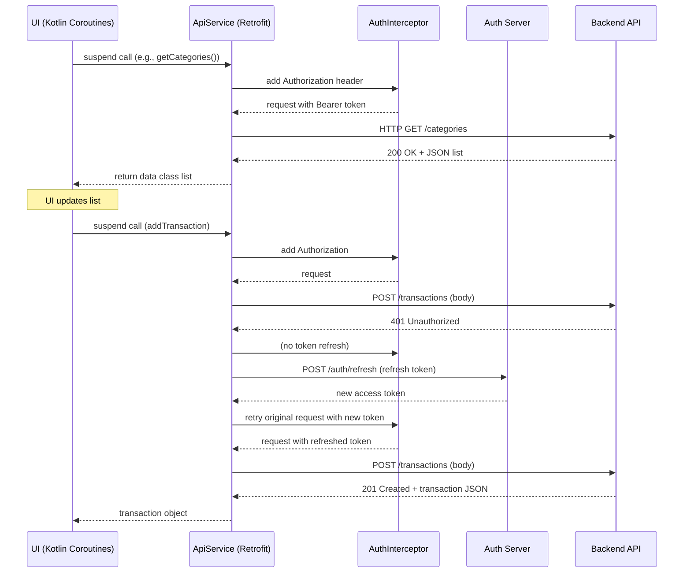

# API Documentation for **Expent** Android Project

---

## Table of Contents
1. [Authentication Overview](#authentication-overview)
2. [Endpoints](#endpoints)
   - [Auth / Google Token Verification](#auth--google-token-verification)
   - [Auth / Refresh Token](#auth--refresh-token)
   - [Categories](#categories)
   - [Accounts (Payment Modes)](#accounts-payment-modes)
   - [Budgets](#budgets)
   - [Expenses & Subscriptions (EMIs)](#expenses--subscriptions-emis)
   - [Transactions](#transactions)
   - [User Customization](#user-customization)
   - [Parse Transaction](#parse-transaction)
3. [Request‑Response Flow Diagram](#requestresponse-flow-diagram)
4. [Error Handling](#error-handling)
5. [Appendix – DTO Schemas](#appendix---dto-schemas)

---

## Authentication Overview
The API uses **Bearer tokens** attached to every request **except** the two authentication endpoints (`auth/google` and `auth/refresh`).

- **Login** – `POST /auth/google` with `AuthRequestDto` → returns `AuthResponseDto` containing `accessToken`, `refreshToken`, and user info.
- **Token Refresh** – `POST /auth/refresh` with `TokenRefreshRequestDto` → returns a new `AuthResponseDto`.

`AuthInterceptor` automatically adds the `Authorization: Bearer <token>` header for all other calls. If a `401` is returned, `TokenAuthenticator` triggers a refresh.

---

## Endpoints

### Auth – Google Token Verification
```http
POST /auth/google
Content-Type: application/json
```
**Request Payload (`AuthRequestDto`)**
```json
{
  "idToken": "string"
}
```
**Response (`AuthResponseDto`)**
```json
{
  "user": {
    "id": "string",
    "email": "string",
    "name": "string",
    "onboardingCount": 0
  },
  "accessToken": "string",
  "refreshToken": "string",
  "onboardingCount": 0
}
```

---

### Auth – Refresh Token
```http
POST /auth/refresh
Content-Type: application/json
```
**Request (`TokenRefreshRequestDto`)**
```json
{
  "refreshToken": "string"
}
```
**Response** – Same shape as `AuthResponseDto`.

---

### Categories
| Method | Path | Request DTO | Response DTO |
|--------|------|-------------|--------------|
| **POST** | `/categories` | `List<CategoryRequestDto>` | `List<CategoryResponseDto>` |
| **GET** | `/categories` | – | `List<CategoryResponseDto>` |
| **DELETE** | `/categories/{id}` | – | – (204 No Content) |

**DTO Overview**
- `CategoryRequestDto`: `name`, `type`, optional `user_id`, `color`, `icon`.
- `CategoryResponseDto`: `id`, `name`, `type`.

---

### Accounts (Payment Modes)
| Method | Path | Request DTO | Response DTO |
|--------|------|-------------|--------------|
| **POST** | `/accounts` | `List<PaymentModeRequestDto>` | `List<PaymentModeResponseDto>` |
| **GET** | `/accounts` | – | `List<PaymentModeResponseDto>` |
| **DELETE** | `/accounts/{id}` | – | – (204) |

**DTO Overview**
- `PaymentModeRequestDto`: `name`, `type`, optional `userId`.
- `PaymentModeResponseDto`: `id`, `name`, `type`, `userId`.

---

### Budgets
| Method | Path | Request DTO | Response DTO |
|--------|------|-------------|--------------|
| **GET** | `/budgets` | – | `List<BudgetResponseDto>` |
| **POST** | `/budgets` | `List<BudgetRequestDto>` | `List<BudgetResponseDto>` |
| **PUT** | `/budgets/{id}` | `BudgetRequestDto` | `BudgetResponseDto` |
| **DELETE** | `/budgets/{id}` | – | – (204) |

**DTO Overview**
- `BudgetRequestDto`: `categoryId?`, `periodType`, `limitAmount`, `startDate`, `endDate?`.
- `BudgetResponseDto`: includes `id`, `userId`, `categoryId?`, `periodType`, `limitAmount`, dates, timestamps, and optional nested `category` object.

---

### Expenses & Subscriptions (EMIs)
| Method | Path | Request DTO | Response DTO |
|--------|------|-------------|--------------|
| **GET** | `/emis` | – | `List<ExpenseIncomeResponseDto>` |
| **POST** | `/emis` | `List<ExpenseIncomeRequestDto>` | `List<ExpenseIncomeResponseDto>` |
| **PUT** | `/emis/{id}` | `ExpenseIncomeRequestDto` | `ExpenseIncomeResponseDto` |
| **DELETE** | `/emis/{id}` | – | – (204) |

**DTO Overview**
- `ExpenseIncomeRequestDto`: fields for amount, type (expense/income), category, account, date, description, etc.
- `ExpenseIncomeResponseDto`: same fields plus generated `id` and timestamps.

---

### Transactions
| Method | Path | Request DTO | Response DTO |
|--------|------|-------------|--------------|
| **GET** (list) | `/transactions?from=...&to=...` | – | `PaginatedTransactionsResponseDto` |
| **GET** (paged) | `/transactions?page=...&limit=...` | – | `PaginatedTransactionsResponseDto` |
| **POST** | `/transactions` | `CreateTransactionRequestDto` | `TransactionResponseDto` |

**DTO Overview**
- `CreateTransactionRequestDto` includes amount, categoryId, accountId, date, notes, type, etc.
- `TransactionResponseDto` returns the persisted transaction with `id` and timestamps.
- `PaginatedTransactionsResponseDto` contains `items: List<TransactionResponseDto>` and pagination metadata (`total`, `page`, `limit`).

---

### User Customization
| Method | Path | Request DTO | Response DTO |
|--------|------|-------------|--------------|
| **GET** | `/user-customization` | – | `UserCustomizationResponseDto` |
| **PUT** | `/user-customization` | `UserCustomizationResponseDto` | `UserCustomizationResponseDto` |

---

### Parse Transaction
```http
POST /parse-transaction
Content-Type: application/json
```
**Request (`ParseTransactionRequestDto`)**
```json
{
  "text": "string"
}
```
**Response (`ParseTransactionResponseDto`)**
```json
{
  "category": "string",
  "amount": 0,
  "date": "2024-01-01",
  "type": "expense | income"
}
```

---

## Request‑Response Flow Diagram


---

## Error Handling
- **401 Unauthorized** – `TokenAuthenticator` catches it, triggers a refresh via `auth/refresh`, then retries the original request.
- **Network errors** – propagated as `IOException`; UI handles with retry UI.
- **Validation errors** – Backend returns **400** with an error JSON; Retrofit maps to a generic `HttpException` that UI can parse.

---

## Appendix – DTO Schemas
| DTO | Fields |
|-----|--------|
| **AuthRequestDto** | `idToken: String` |
| **AuthResponseDto** | `user: UserDto`, `accessToken: String`, `refreshToken: String`, `onboardingStep: Int` |
| **UserDto** | `id: String`, `email: String`, `name: String`, `onboardingStep: Int` |
| **TokenRefreshRequestDto** | `refreshToken: String` |
| **TokenRefreshResponseDto** | Same as `AuthResponseDto` |
| **CategoryRequestDto** | `name: String`, `type: String`, `user_id?: String`, `color?: String`, `icon?: String` |
| **CategoryResponseDto** | `id: String`, `name: String`, `type: String` |
| **BudgetRequestDto** | `categoryId?: String`, `periodType: String`, `limitAmount: Double`, `startDate: String`, `endDate?: String` |
| **BudgetResponseDto** | `id: String`, `userId: String`, `categoryId?: String`, `periodType: String`, `limitAmount: String`, `startDate: String`, `endDate?: String`, `createdAt?: String`, `updatedAt?: String`, `category?: BudgetCategoryDto` |
| **BudgetCategoryDto** | `id: String`, `name: String`, `color?: String`, `icon?: String` |
| **PaymentModeRequestDto** | `name: String`, `type: String`, `userId?: String` |
| **PaymentModeResponseDto** | `id: String`, `name: String`, `type: String`, `userId: String` |
| **ExpenseIncomeRequestDto** | `amount: Double`, `type: String`, `categoryId: String?`, `accountId: String?`, `date: String`, `description?: String` |
| **ExpenseIncomeResponseDto** | same fields + `id: String`, timestamps |
| **CreateTransactionRequestDto** | `amount: Double`, `categoryId: String?`, `accountId: String?`, `date: String`, `notes?: String`, `type: String` |
| **TransactionResponseDto** | all request fields + `id: String`, `createdAt`, `updatedAt` |
| **PaginatedTransactionsResponseDto** | `items: List<TransactionResponseDto>`, `total: Int`, `page: Int`, `limit: Int` |
| **UserCustomizationResponseDto** | `currency: String?`, `theme: String?` |
| **ParseTransactionRequestDto** | `text: String` |
| **ParseTransactionResponseDto** | `category: String`, `amount: Double`, `date: String`, `type: String` |

---

*Generated on 2026‑06‑09. Use this file as the definitive reference for all network interactions in the Expent app.*
