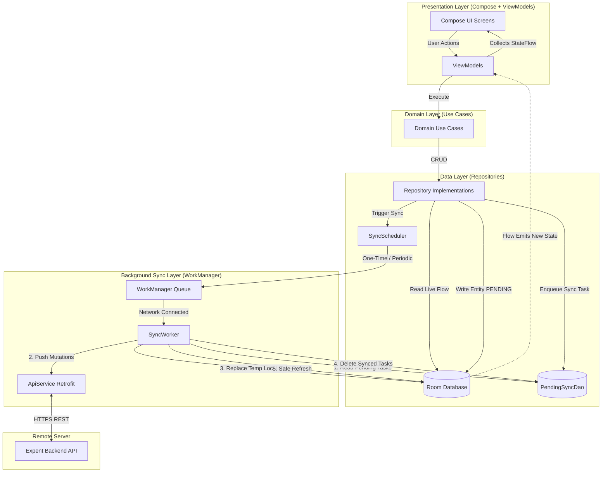
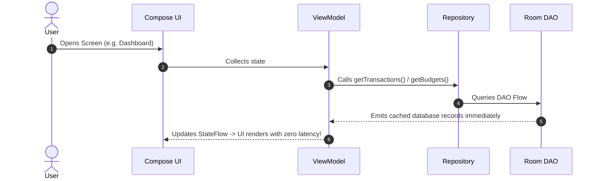
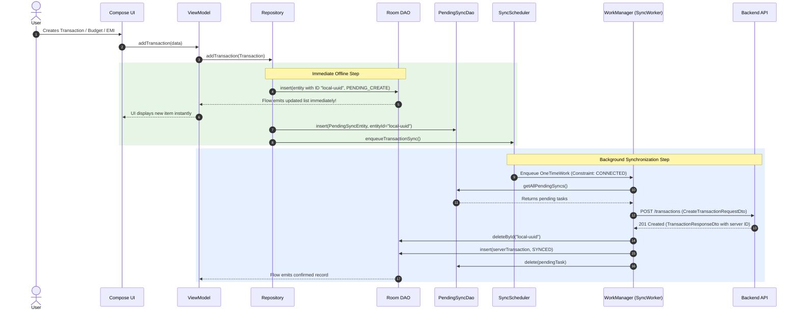

# Expent: Offline-First Architecture & Synchronization Engine

A comprehensive technical guide to the **Offline-First** architecture of the Expent Android application, utilizing **Room Database as the Single Source of Truth (SSOT)** and **WorkManager** for background synchronization with the remote backend.

---

## 1. Architectural Philosophy

The core principle behind this architecture is: **The local database is the single source of truth for the UI; the network is merely an asynchronous sync mechanism.**

```
+-------------------------------------------------------------------------+
|                               UI LAYER                                  |
|            Jetpack Compose Screens & StateFlow ViewModels               |
+------------------------------------+------------------------------------+
                                     |  Reads Flows (Reactive)
                                     v
+-------------------------------------------------------------------------+
|                              DATA LAYER                                 |
|                                                                         |
|      +-----------------------------------------------------------+      |
|      |               Room Database (Local SSOT)                  |      |
|      |  - Transactions     - Categories     - Payment Modes     |      |
|      |  - Budgets          - Expenses/EMIs  - Customizations     |      |
|      +-----------------------------+-----------------------------+      |
|                                    ^                                    |
|             Writes (Optimistic)    | Updates on Sync                    |
|                                    |                                    |
|      +-----------------------------+-----------------------------+      |
|      |              PendingSyncQueue (`pending_sync`)             |      |
|      |  Stores: entityType, entityId, operation, payload, retries|      |
|      +-----------------------------+-----------------------------+      |
|                                    |                                    |
+------------------------------------|------------------------------------+
                                     | Triggers Work (Constraints: CONNECTED)
                                     v
+-------------------------------------------------------------------------+
|                         BACKGROUND SYNC LAYER                           |
|                       WorkManager (`SyncWorker`)                        |
|   1. Dequeue & push pending mutations (CREATE / UPDATE / DELETE)        |
|   2. Swap local temp IDs (`local-...`) with server entities             |
|   3. Refresh remote data into Room safely via `clearSynced()`           |
+------------------------------------+------------------------------------+
                                     |
                                     v
+-------------------------------------------------------------------------+
|                             REMOTE BACKEND                              |
|                          REST API (Render.com)                          |
+-------------------------------------------------------------------------+
```

### Key Guarantees
1. **Instant UI Response (Zero Latency)**: Every user mutation (adding a transaction, updating an EMI, saving a category) writes directly to Room. The UI updates instantly via Room reactive `Flow` emissions without waiting for network responses or spinners.
2. **100% Offline Capability**: All reads and writes work with or without an active internet connection.
3. **No Lost Local Data**: When remote data is refreshed, local items pending sync are preserved through partition-aware clearing (`clearSynced()`).
4. **Duplicate Prevention**: Locally created entities receive temporary identifiers (`local-${UUID}`). When `SyncWorker` successfully pushes them to the server, it swaps the local entity with the confirmed server entity.
5. **Resilient Retry Policy**: Failed requests are backed off and retried when network connectivity is restored, while poisoned/unrecoverable requests are discarded after 5 attempts.

---

## 2. End-to-End System Architecture Diagram



---

## 3. Data Flow: Read vs. Write Paths

### 3.1 The Read Flow (Reactive SSOT)
The UI never calls network endpoints directly to display data. Instead, it observes Room database tables via Kotlin `Flow`.



### 3.2 The Write Flow (Optimistic Local + Queued Sync)
When the user creates, updates, or deletes an item:



---

## 4. Background Sync Engine (`SyncWorker`)

The background sync engine is powered by Android's **WorkManager** framework, executing inside [`SyncWorker.kt`](file:///c:/Users/Aditya%20Sharma/AndroidStudioProjects/expent/app/src/main/java/com/aditya/expent/data/sync/SyncWorker.kt).

### 4.1 Sync Triggers
WorkManager executes sync jobs under two strategies configured in [`SyncScheduler.kt`](file:///c:/Users/Aditya%20Sharma/AndroidStudioProjects/expent/app/src/main/java/com/aditya/expent/data/sync/SyncScheduler.kt):

| Trigger Type | Policy | Frequency / Timing | Constraints | Purpose |
| :--- | :--- | :--- | :--- | :--- |
| **Periodic Sync** | `KEEP` | Every 15 minutes | `NetworkType.CONNECTED` | Periodic consistency check, pulls remote edits |
| **Initial Sync** | `REPLACE` | On login & app cold start | `NetworkType.CONNECTED` | Hydrates Room with latest remote data on launch |
| **On-Demand Sync** | `REPLACE` | Immediately upon local mutation | `NetworkType.CONNECTED` | Fast dispatch of pending offline actions when online |

### 4.2 Pending Sync Lifecycle & State Machine

```mermaid
stateDiagram-v2
    [*] --> PendingCreate: User creates entity offline
    [*] --> PendingUpdate: User updates entity offline
    [*] --> PendingDelete: User deletes entity offline

    PendingCreate --> InFlight: WorkManager triggers with network
    PendingUpdate --> InFlight: WorkManager triggers with network
    PendingDelete --> InFlight: WorkManager triggers with network

    InFlight --> Synced: API call succeeds (200/201)
    Synced --> [*]: Task deleted from pending_sync; local ID swapped

    InFlight --> RetryPending: Network error / 5xx error
    RetryPending --> InFlight: retryCount < 5 (Exponential backoff)
    RetryPending --> Discarded: retryCount >= 5 (Corrupted / 4xx)
    Discarded --> [*]: Task dropped from pending_sync
```



---

## 5. Duplicate Prevention & Safe Refreshing

### 5.1 ID Swap Algorithm (Duplicate Prevention)
When an item is created offline, the client does not yet know the backend's database ID.
1. The repository generates a temporary identifier prefixed with `local-` (e.g., `local-9b1deb4d-3b7d-4bad-9bdd-2b0d7b3dcb6d`).
2. The entity is inserted into Room with this ID and `SyncStatus.PENDING_CREATE`.
3. A pending task is recorded with `entityId = "local-..."`.
4. Once online, `SyncWorker` sends the payload to the server.
5. The server returns the created record with its permanent server ID (e.g., `66f5c8e2a...`).
6. `SyncWorker` performs an atomic swap:
   ```kotlin
   entryPoint.transactionDao().deleteById(item.entityId) // removes "local-..."
   entryPoint.transactionDao().insert(created.toEntity(SyncStatus.SYNCED)) // inserts server entity
   ```
7. This completely avoids having both the temporary local entity and the server-returned entity in the same table.

### 5.2 Safe Partitioned Clearing (`clearSynced()`)
Prior to this restructuring, repositories called `clear()` before inserting newly fetched remote data. If an offline entity was sitting in the table, `clear()` erased it before it could ever sync.

The safe pattern now implemented across all DAOs:
```sql
DELETE FROM table_name 
WHERE syncStatus = 'SYNCED' 
  AND id NOT LIKE 'local-%'
```
This guarantees that **only records already verified with the server are cleared and replaced**, while offline pending records remain intact until `SyncWorker` pushes them.

---

## 6. Database Entity Schema & Sync Status

Each mutable Room entity contains sync tracking fields:

| Field | Type | Description |
| :--- | :--- | :--- |
| `id` | `String` (PK) | Permanent server ID or temporary `local-${UUID}` |
| `syncStatus` | `SyncStatus` enum | `SYNCED`, `PENDING_CREATE`, `PENDING_UPDATE`, `PENDING_DELETE` |
| `isDeleted` | `Boolean` | Soft-delete flag so queries can filter out pending deletes |

### Sync Status Enum
```kotlin
enum class SyncStatus {
    SYNCED,          // Clean state; identical to server
    PENDING_CREATE,  // Created locally, waiting to be sent to server
    PENDING_UPDATE,  // Updated locally, waiting to be sent to server
    PENDING_DELETE   // Marked deleted locally, waiting to be deleted on server
}
```

### Table Overview

| Table Name | Entity Class | DAO Interface | Sync Support |
| :--- | :--- | :--- | :--- |
| `transactions` | [`TransactionEntity`](file:///c:/Users/Aditya%20Sharma/AndroidStudioProjects/expent/app/src/main/java/com/aditya/expent/data/local/entity/TransactionEntity.kt) | [`TransactionDao`](file:///c:/Users/Aditya%20Sharma/AndroidStudioProjects/expent/app/src/main/java/com/aditya/expent/data/local/dao/TransactionDao.kt) | Full (Create, Safe Refresh) |
| `categories` | [`CategoryEntity`](file:///c:/Users/Aditya%20Sharma/AndroidStudioProjects/expent/app/src/main/java/com/aditya/expent/data/local/entity/CategoryEntity.kt) | [`CategoryDao`](file:///c:/Users/Aditya%20Sharma/AndroidStudioProjects/expent/app/src/main/java/com/aditya/expent/data/local/dao/CategoryDao.kt) | Full (Create, Delete, Safe Refresh) |
| `accounts` | [`AccountEntity`](file:///c:/Users/Aditya%20Sharma/AndroidStudioProjects/expent/app/src/main/java/com/aditya/expent/data/local/entity/AccountEntity.kt) | [`AccountDao`](file:///c:/Users/Aditya%20Sharma/AndroidStudioProjects/expent/app/src/main/java/com/aditya/expent/data/local/dao/AccountDao.kt) | Full (Create, Delete, Safe Refresh) |
| `budgets` | [`BudgetEntity`](file:///c:/Users/Aditya%20Sharma/AndroidStudioProjects/expent/app/src/main/java/com/aditya/expent/data/local/entity/BudgetEntity.kt) | [`BudgetDao`](file:///c:/Users/Aditya%20Sharma/AndroidStudioProjects/expent/app/src/main/java/com/aditya/expent/data/local/dao/BudgetDao.kt) | Full (Create, Update, Delete, Safe Refresh) |
| `expenses` | [`ExpenseEntity`](file:///c:/Users/Aditya%20Sharma/AndroidStudioProjects/expent/app/src/main/java/com/aditya/expent/data/local/entity/ExpenseEntity.kt) | [`ExpenseDao`](file:///c:/Users/Aditya%20Sharma/AndroidStudioProjects/expent/app/src/main/java/com/aditya/expent/data/local/dao/ExpenseDao.kt) | Full (Create, Update, Delete, Safe Refresh) |
| `customizations`| [`CustomizationEntity`](file:///c:/Users/Aditya%20Sharma/AndroidStudioProjects/expent/app/src/main/java/com/aditya/expent/data/local/entity/CustomizationEntity.kt) | [`CustomizationDao`](file:///c:/Users/Aditya%20Sharma/AndroidStudioProjects/expent/app/src/main/java/com/aditya/expent/data/local/dao/CustomizationDao.kt) | Full (Update, Safe Refresh) |
| `pending_sync` | [`PendingSyncEntity`](file:///c:/Users/Aditya%20Sharma/AndroidStudioProjects/expent/app/src/main/java/com/aditya/expent/data/local/entity/PendingSyncEntity.kt) | [`PendingSyncDao`](file:///c:/Users/Aditya%20Sharma/AndroidStudioProjects/expent/app/src/main/java/com/aditya/expent/data/local/dao/PendingSyncDao.kt) | Sync queue engine |

---

## 7. Key Files & Responsibilities

| File Path | Layer | Primary Responsibility |
| :--- | :--- | :--- |
| [`ExpentApplication.kt`](file:///c:/Users/Aditya%20Sharma/AndroidStudioProjects/expent/app/src/main/java/com/aditya/expent/ExpentApplication.kt) | App Lifecycle | Initializes periodic sync and cold-start sync if user is logged in |
| [`SyncWorker.kt`](file:///c:/Users/Aditya%20Sharma/AndroidStudioProjects/expent/app/src/main/java/com/aditya/expent/data/sync/SyncWorker.kt) | Background Sync | Reads `pending_sync`, calls API endpoints, swaps IDs in Room, pulls fresh data |
| [`SyncScheduler.kt`](file:///c:/Users/Aditya%20Sharma/AndroidStudioProjects/expent/app/src/main/java/com/aditya/expent/data/sync/SyncScheduler.kt) | Background Sync | Configures WorkManager requests with network constraints |
| [`PendingSyncDao.kt`](file:///c:/Users/Aditya%20Sharma/AndroidStudioProjects/expent/app/src/main/java/com/aditya/expent/data/local/dao/PendingSyncDao.kt) | Local Storage | Persists the queue of pending offline tasks |
| [`TransactionRepositoryImpl.kt`](file:///c:/Users/Aditya%20Sharma/AndroidStudioProjects/expent/app/src/main/java/com/aditya/expent/data/repository/TransactionRepositoryImpl.kt) | Repository | Saves transactions locally with `local-` prefix and enqueues sync |
| [`IncomeBudgetRepositoryImpl.kt`](file:///c:/Users/Aditya%20Sharma/AndroidStudioProjects/expent/app/src/main/java/com/aditya/expent/data/repository/IncomeBudgetRepositoryImpl.kt) | Repository | Saves budgets locally and enqueues standardized DTO payloads |
| [`ExpenseAndSubscriptionRepositoryImpl.kt`](file:///c:/Users/Aditya%20Sharma/AndroidStudioProjects/expent/app/src/main/java/com/aditya/expent/data/repository/ExpenseAndSubscriptionRepositoryImpl.kt) | Repository | Saves EMIs and subscriptions locally and enqueues sync tasks |
| [`DashboardViewModel.kt`](file:///c:/Users/Aditya%20Sharma/AndroidStudioProjects/expent/app/src/main/java/com/aditya/expent/presentation/dashboard/DashboardViewModel.kt) | Presentation | Observes Room flows for live updates; optimistic transactions |

---

## 8. Developer Guide: Adding a New Entity to Offline-First

When adding a new entity (e.g. `GoalEntity`) to the offline-first sync engine:

1. **Entity**: Add `syncStatus: SyncStatus = SyncStatus.SYNCED` and `isDeleted: Boolean = false` to the entity data class.
2. **DAO**:
   - Filter queries with `WHERE (isDeleted = 0 OR isDeleted IS NULL)`.
   - Add `@Query("DELETE FROM goals WHERE id = :id") suspend fun deleteById(id: String)`.
   - Add `@Query("DELETE FROM goals WHERE syncStatus = 'SYNCED' AND id NOT LIKE 'local-%'") suspend fun clearSynced()`.
   - Add `replaceAll()` that calls `clearSynced()` followed by `insert(goals)`.
3. **Repository**:
   - In `createGoal(goal)`: insert entity with `id = "local-${UUID.randomUUID()}"` and `syncStatus = PENDING_CREATE`.
   - Insert a `PendingSyncEntity(entityType = "goal", entityId = entity.id, operation = "CREATE", payload = gson.toJson(dto))`.
   - Call `syncScheduler.enqueueGoalSync()`.
4. **`SyncWorker.kt`**:
   - Expose `goalDao()` in `SyncWorkerEntryPoint`.
   - In `processPendingItem()`: add `"goal"` case to call `apiService.createGoal(dto)`, delete local temp ID via `goalDao().deleteById(item.entityId)`, and insert server response.
   - In `doWork()` step 2: call `runCatching { goalRepo.refreshGoals() }`.
